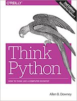
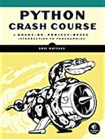
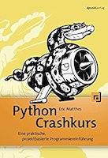

# Pythonschulung

Slides und Quellcode für meine Python-Schulung am MPIWG im August/September 2018.

## Dokumentation

Die wichtigste Quelle ist die offizielle Python-Dokumentation:

- [Python 3.6-Dokumentation (englisch)](https://docs.python.org/3.6/) -- das ist die Python-Version, die in der Schulung Anwendung findet.
- Mutige können auch in das ganz frische [Python 3.7](https://docs.python.org/3.7/) hineinschauen.
- Und wer gezwungen ist, mit Python 2.7 zu arbeiten, [findet hier die Dokumentation](https://docs.python.org/2.7/).
- Ein wenig versteckt is die Dokumentation zum im Kurs verwendeten `turtle`-Frameworks, für Python 3.6 [findet Ihr sie hier](https://docs.python.org/3.6/library/turtle.html).

## Tutorials und Lehrbücher

  

Ich habe mich zur Vorbereitung für diesen Kurs an das Buch »[Think Python – How to Think Like a Computer Scientist](https://amzn.to/2wyRK1d)« von *[Allen B. Downey](https://en.wikipedia.org/wiki/Allen_B._Downey)* gehalten. Es ist nicht nur im Buchhandel erhältlich, sonder kann [hier](http://greenteapress.com/wp/think-python-2e/) auch kostenlos als PDF oder HTML heruntergeladen werden. Vorsichtig! Die bei O'Reilly erschienene deutsche Übersetzung »Programmieren lernen mit Python« ist eine Übersetzung der ersten Auflage, die Python 2.7 behandelt.

Ein ebenfalls großartiges Lehrbuch zu Python mit einem bedeutend größeren Umdang, das auch mehr Themen behandelt, ist der »[Python Crash Course – A Hands-On, Project-Based Introduction to Programming](https://amzn.to/2Q08uGq)« von *Eric Matthes*. Das Buch gibt es unter dem Titel »[Python Crashkurs – Eine praktische, projektbasierte Programmiereinführung](https://amzn.to/2wyTgjV)« auch auf Deutsch. Das Buch kann ich allen empfehlen, die nach Abschluß des Kurses auf eigene Faust weitermachen wollen.

Neben diesen beiden Empfehlungen gibt es viele weitere gute, aber auch etliche schlechte Bücher zu Python. Solltet Ihr Interesse an Literatur Spezialthemen haben (zum Beispiel *Data Science*, *Künstliche Intelligenz*, *Natural Language Processing*) fragt mich bitte vorher -- ich habe ziemlich viel gelesen und auch rezensiert.
