<!-- $theme: gaia -->
<!-- page_number: true -->


# Python für absolute Anfänger

## (Ein Crash-Kurs)

(cc) 2018 by Jörg Kantel

---

# Hallo Welt 👋

```python
print("Hallo Jörg!")
```

- Man beachte, daß Python3 UTF-8-fest ist. 
- In Python 2.7 müßte das Skript folgendermaßen aussehen:

```python
# coding=utf-8

print(u"Hallo Jörg!")
```
---

# Was ist Python?

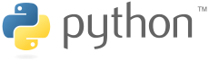

## Und warum sollte man Python lernen?

---

# Was ist Python?

- Python ist eine moderne Interpreter-Sprache
- Sie wurde 1991 von *Guido van Rossum* entwickelt
- Guido van Rossum war ein großer Fan der Komiker-Truppe *Monty Python*
- Dennoch hat sich das Schlangensymbol erhalten

---

# Was macht Python aus?

- Python wurde mit dem Ziel der größten Übersichtlichkeit und Einfachheit entworfen
- Der eigentliche Sprachkern (die *Schlüsselwörter*) ist klein, daher zuerst einmal leicht zu erlernen
- Python ist eine *Multiparadigmensprache*, sie zwingt Programmierern keinen Stil auf (z.B. prozedural, funktional oder objektorientiert zu programmieren)

---

# Die Vorteile von Python

- Für Programmieranfänger erst einmal leicht zu lernen
- *Batteries included*, das heißt, (fast) alles wichtige bringt Python in seinen Standard-Bibliotheken mit
- Leichte Lesbarkeit: Python ist *ausführbarer Pseudocode*
- Einige Bibliotheken (wie numpy, scipy, scikit-learn, pandas) haben Python zu einem *defacto*-Standard-Werkzeug für wissenschaftliches Rechnen und *Data Science* gemacht

---


# Aber … (die Nachteile von Python)

- Die Vielzahl der vorhandenen Bibliotheken verwirrt manchmal (entgegen dem *Zen of Python* gibt es für viele Probleme unterschiedliche Lösungen/Bibliotheken
- Der (unnötige) Bruch zwischen Python 2.7 und Python 3 hat die Community gespalten
- Python ist (nach heutigen Maßstäben) langsam (das kann aber durch in C oder FORTRAN geschriebene Bibliotheken kompensiert werden)


---

# Warum sollte man Python lernen?


---

# Warum sollte man Python lernen (2)?

- (C)Python ist plattformübergreifend (macOS, Windows, Linux, RaspberryPi, Android (aber kein iOS)
- Python ist vielseitig (wissenschaftliches Rechnen, Web-Entwicklung, Spiele und Simulationen etc.)
- Die Programmierung mit Python macht Spaß
- Und *last but not least*: Lernt programmieren, sonst werdet Ihr programmiert!

---

# Was macht Python besonders aus?

- Python kann interaktiv im Interpreter programmiert werden (REPL: *Read - Eval - Print - Loop*)
- Die Typverwaltung ist *dynamisch* (das heißt der Datentyp muß nicht **vor** der ersten Nutzung vereinbart werden

---

<div style="float:right"></div>

- Bei der Typ-Erkennung geht Python nach dem **Duck-Typing**-Prinzip vor: Wenn es quackt wie eine Ente und watschelt wie eine Ente, dann ist es eine Ente
- In Python ist alles ein **Objekt**
- Variabeln sind per Default nur **lokal** gültig
- Blöcke werden durch **Einrückungen** und nicht durch Klammern gekennzeichnet

---

# The Zen of Python

~~~python
import this
~~~

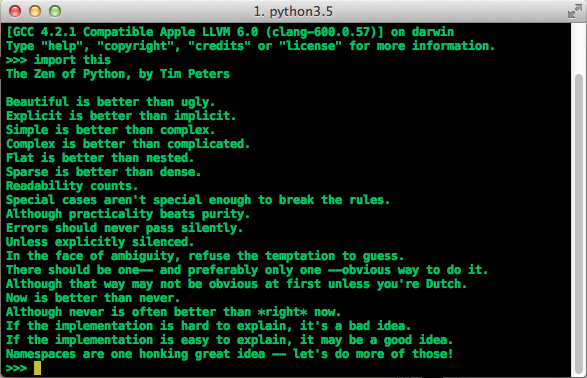

---


---

# Python 2 oder Python 3?

- Python 2.7 war lange Zeit Standard
- In Python 3 wurden einige Änderungen vorgenommen, über die nicht alle glücklich sind
- Python 2.7 wird mindestens bis 2020 gepflegt (Security Updates etc.)
- Aber nur Python 3 wird noch weiterentwickelt

---

# Should I stay or should I go?

**Python 3**

- Wenn es geht! (Unterstützen alle gebrauchten Bibliotheken Python 3?)
- Wenn man auf standardisierte Unicode- (UTF-8-) Unterstützung angewiesen ist
- Wenn man zukunftsfähig programmieren will oder muß

---

# Aber

**Python 2.7**

- Wenn es nicht anders geht (wenn man zum Beispiel PyGame oder NodeBox einsetzen möchte)
- Jython! (dazu später mehr)
- Wenn man auf einen Fundus von Bibliotheken (speziell zu Netzwerken) zurückgreifen muß
- Wenn man Python 2.7 liebt (und die Neuerungen in Python 3 nicht mag)

---

# Also?

- Im Zweifelsfalle Python 3

- Ich werde während dieses Kurses meistens Python&nbsp;3 verwenden, aber immer auf die Unterschiede zu Python 2.7 hinweisen

- Aber einige von den Methoden in Python 3 nicht verwenden (man braucht dieses Informatikergew****e nicht, um sauber in Python zu programmieren (die wichtigsten werde ich aber zumindest erwähnen)


---

# Das Python-Universum

- Python oder CPython
- Jython
- Stackless Python
- PyPy
- IronPython und PythonNet
- Kivy

---

# CPython

- **Python** oder **CPython** ist die Standard-Referenz-Implementierung (in C geschrieben und mit allen wichtigen Bibliotheken (zum Beispiel numpy, scipy, pandas) kompatibel

- Gibt es als Python 2.7 und Python 3
- Die aktuelle Version 2.7.5 resp. 3.6

---

# Jython

- **Jython** ist eine in Java geschriebene Python-Implementierung. Sie ist weitestgehend mit Python 2.7 kompatibel. Naturgemäß funktionieren nicht alle (in C geschriebenen) Bibliotheken
- Kann mit Java-Bibliotheken verknüpft werden (Swing)
- Wichtige Implementierungen:
    - Processing.py (dazu später mehr)
    - TigerJython

---

# TigerJython

- **TigerJython** ist eine plattformübergreifende freie Entwicklungs- und Lernumgebung für Python
- TigerJython ist in Jython geschrieben, daher Python 2.7
- TigerJython implementiert die Turtle-Graphik und enthält interessante Module zur Spieleprogrammierung und zur Robotik


---

# Kivy

- **Kivy** ist eine ist ein Python-GUI-Toolkit zur plattformübergreifenden Programmierung grafischer Benutzeroberflächen
- Kivy stellt eine Bibliothek bereit, um Multitouch-Apps mit *Natural User Interfaces* (NUI) zu entwickeln. Die App kann dann unter Android, iOS, Linux, Mac OS X oder Windows laufen
- Kivy ist derzeit die einzige Möglichkeit, mit Python iOS-Anwendungen zu entwickeln

---

# Die anderen

- **Stackless Python** ist ein CPython für Multi-Prozessor-Umgebungen
- **PyPy** ist ein Python geschriebener in Python-Interpreter. Es soll unglaublich schnell sein (nur Python 2.7)
- **IronPython** und **PythonNet** sind Python-Interpreter für Microsofts .NET-Umgebung. Beide verfolgen aber einen unterschiedlichen Ansatz für die Integration, wobei IronPython die Nase vorne hat

---

# Wo läuft eigentlich überall Python?

- Python ist die interne Skriptsprache in **Blender** und in **QGIS** (Quantum GIS)
- **Ren’Py** ist eine Entwicklungsumgebung für *Visual Novels*, die in Python geschrieben wurde und Python als Skriptsprache einsetzt
- Mit Python können Plugins für die Bildverarbeitungssoftware **GIMP** programiert werden (Python-Fu)
- usw. usf…

---

# Was ich heute kurz vorstellen möchte

- (C)Python 3 (mit den Unterschieden zu 2.7)
- IPython und Jupyter (Python 3)
- Processing.py (Jython)
- NodeBox 1 (Python 2.7, Mac only)

---

# Python 3 mit IPython

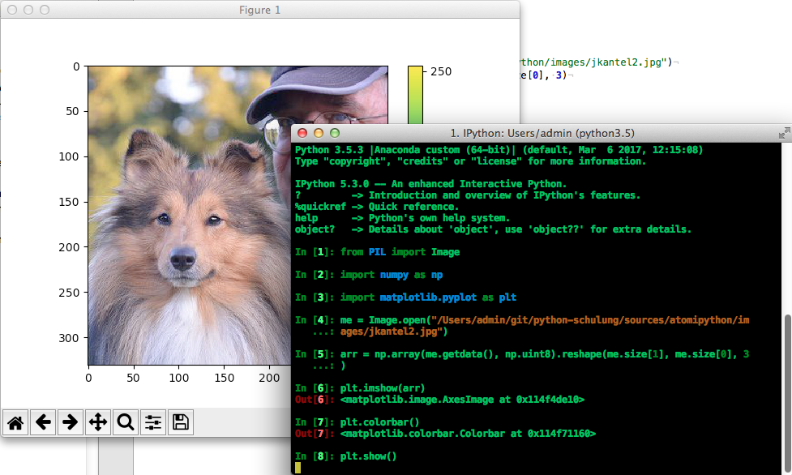

---

**Python 3 mit Jupyter**

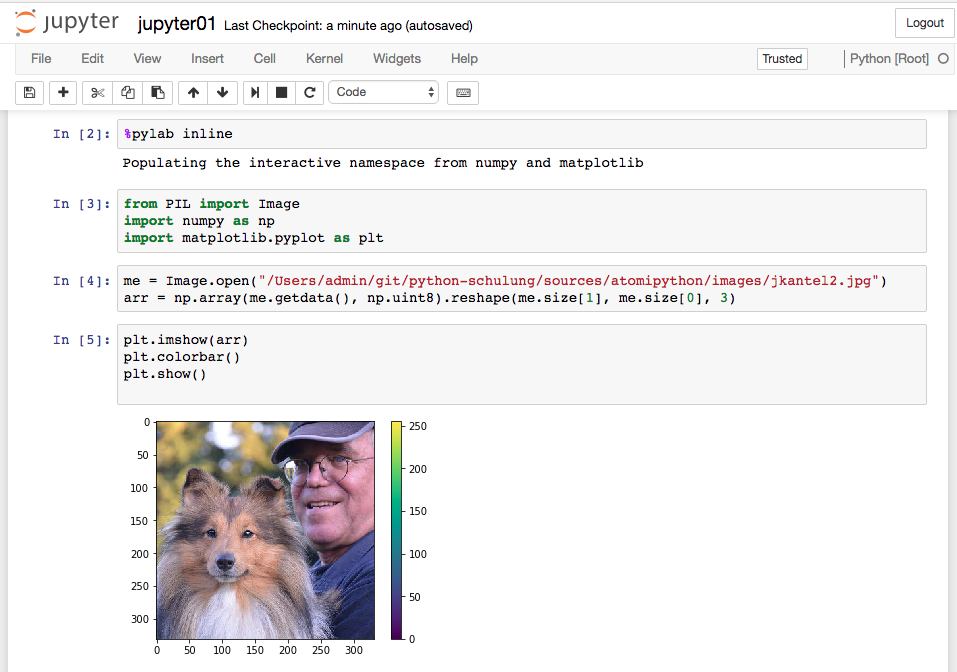

---

## JupyterLab

- Obwohl browserbasiert ist JupyterLab eher eine IDE (stark von RStudio beeinflußt) mit Texteditor, Filebrowser, diversen Ausgabefenstern, Interpreter etc.
- Man hat gar nicht mehr den Eindruck, im Browser zu editieren (editieren zu müssen).

---

## JupyterLab (2)

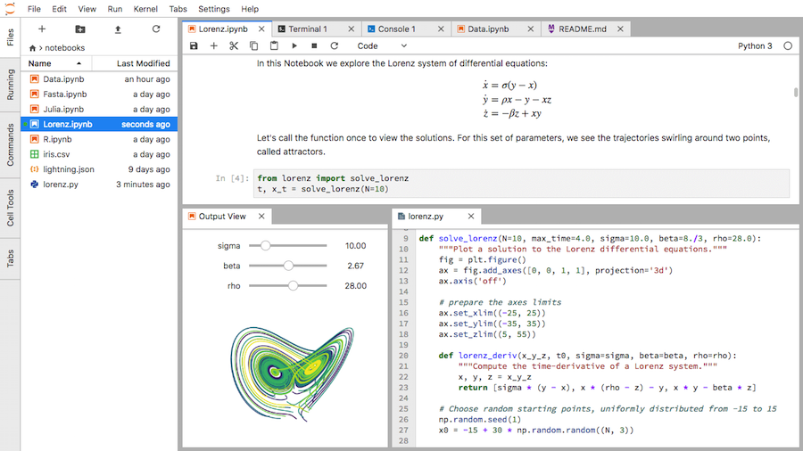

Das könnte was werden!

---

# Processing.py

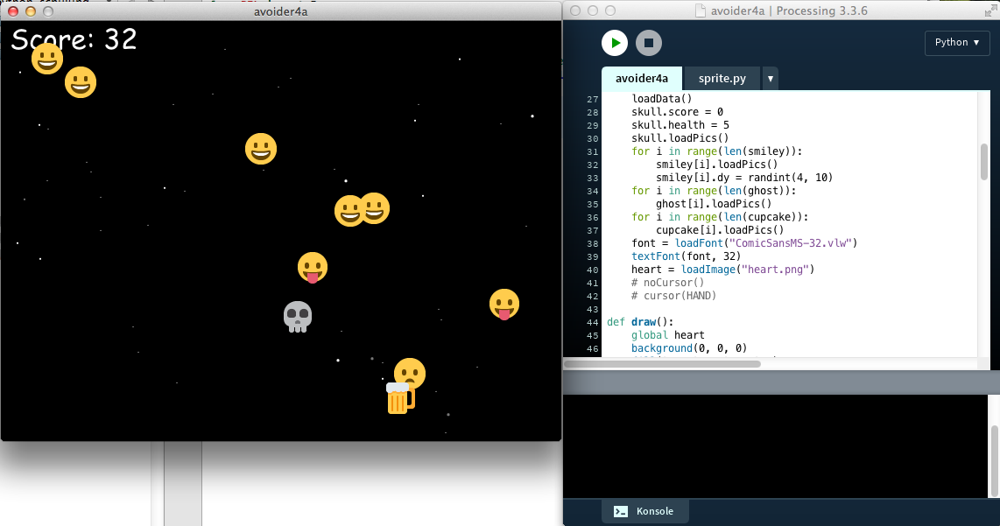

---

# NodeBox 1 (1)

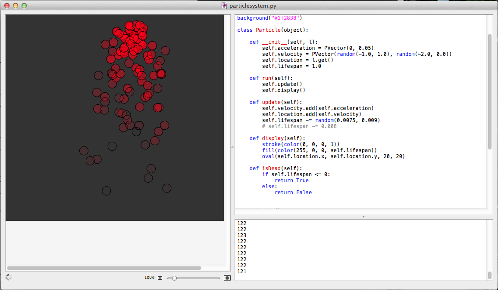

---

# NodeBox 1 (2)

Die *Knotenschachtel*, wenn auch Mac only, ist eine interessante Alternative zu Processing.py, denn

- sie bringt nicht nur ihr eigenes Python (2.7), sondern in der *extended Version* auch NumPy, SciPy, scikit-learn, pandas, NLTK, WordNet und viele andere Bibliotheken mit
- sie ermöglicht interessante Visualisierungen (besonders, da `matplotlib.animate` auf dem Mac nicht funktioniert)

---

# Wichtige Bibliotheken und Pakete

## Der *Scientific Stack*

- numpy, Scipy und die matplotlib
- pandas
- scikit-learn
- PIL / pillow
- NLTK

---

# numpy, SciPy und die matplotlib (1)

- **numpy** ist eine Bibliothek für numerische Mathematik
- Sie ist ein Wrapper um FORTRAN- und C-Bibliotheken wie LAPACK, ODE etc.
- Sie läuft daher nur mit CPython
- Sie ermöglicht Vektor- und Matrizen-Operationen ohne Schleifen und ist daher unglaublich schnell

---

## numpy, SciPy und die matplotlib (2)


- **SciPy** ist ein auf *numpy* aufsetzendes Paket mit weiteren numerischen Algorithmen (ebenfalls meist auf Basis von FORTRAN- oder C-Bibliotheken)

---

## numpy, SciPy und die matplotlib (3)

- die **matplotlib** ist ein Paket zur (interaktiven) Erstellung von Visualisierungen und Graphen. Auch sie setzt auf *numpy* auf

Diese drei Pakete werden in der Regel zusammen installiert.

---

# pandas (1)

**pandas** ist eine Python-Bibliothek zum Auswerten und Bearbeiten tabellarischer Daten. Sie operiert auf drei Arten von Objekten

- Eine *Serie* entspricht  etwa einer Liste, beispielsweise einer Zeitreihe, einer Liste, einem Dict, oder einem numpy-Array
- Ein *Dataframe* ist etwas ähnliches wie eine Spreadsheet- (Excel-) Tabelle.

---

# pandas (2)
- Ein *Panel* besteht aus einer »dreidimensionalen« Tabelle. Die einzelnen Ebenen sind wieder Dataframes

Auch *pandas* setzt auf *numpy* auf.

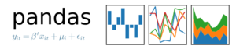

---

# scikit-learn

**scikit-learn** ist eine Python-Bibliothek für maschinelles Lernen. Sie benötigt *numpy* und *SciPy*.


---

# PIL/Pillow

- **PIL** (Python Image Library) ist *die* Bibliothek für Bildverarbeitung und Bildmanipulation in Python (gewissermaßen das *ImageMagick* für Python)
- PIL läuft leider nur mit Python 2.7 (oder kleiner), daher gibt es mit **Pillow** ein Fork für Python 3, die nahezu funktions- und aufrufidentisch ist
- PIL/Pillow besitzen auch Funktionen, um Bild-Dateien für das GUI-Toolkit **Tkinter** aufzubereiten

---

# NLTK

- Das **Natural Language Toolkit** (NLTK) ist eine Zusammenstellung von Bibliotheken und Programmen der Programmiersprache Python (ab Version 2.6) für Anwendungen der Computerlinguistik
- Das NLTK ist quelloffen und wird unter der Apache-Lizenz vertrieben
- Erst seit einigen Monaten gibt es auch eine Version des NLTK für Python 3

---

## Sonstige wichtige Pakete

- Pyglet und cocos2d (Python)
- PyGame
- OpenCV
- VPython


---

# Pyglet und cocos2d

- **Pyglet** ist eine freie, plattformübergreifende Bibliothek zur Programmierung multimedialer Anwendungen (Audio, Video und Animationen)
- Pyglet setzt auf *OpenGL* auf
- **cocos2d** (Python) ist eine auf Pyglet aufsetzende Bibliothek zur Spieleprogrammierung 

---

# PyGame

- **PyGame** ist ebenfalls eine plattformübergreifende Python-Bibliothek zur Spieleprogrammierung und so etwas wie die Standard-Bibliothek für Spiele und Simualtionen in Python (2D und 3D)
- PyGame ist ein *Wrapper* für das in C geschriebene  SDL *(Simple Direct Layer)*, das heißt, die Installation ist etwas haarig
- PyGame funktioniert nicht vernünftig mit Python&nbsp;3 (Ausnahme: Raspberry Pi), aber problemlos mit Python 2.7

---

# OpenCV

- Python besitzt *Bindings* zu **OpenCV** *(Open Source Computer Vision)*, einer Bibliothek zur Bild- und Video-Bearbeitung in Echtzeit
- OpenCV ist in C++ geschrieben, das heißt auch hier ist die Installation nicht einfach
- OpenCV ist so etwas wie **der** Standard für die Bildanalyse und Bilderkennung (zum Beispiel Gesichtserkennung)

---

# VPython

- **VPython** ist eine Python-Entwicklungsumgebung für 3D-Simulationen
- VPython besteht aus einem Python-Interpreter und einem 3D-Graphik-Modul namens *Visual*
- Visual ist in C++ geschrieben
- VPython ist *cross platform* und Open-Source
- Es gibt VPython für Python 2.7 und Python 3 (?)

---


# Welches Python?

- Python ist auf jedem Mac vorinstalliert (System-Python)
- Das System-Python wird auch vom OS genutzt
- Daher besser nicht anrühren
- Anaconda-Python ist die Lösung für (fast) alles

---

# Warum Anaconda-Python?

- Anaconda-Python ist eine Python-Distribution, die nahezu den gesamten wissenschaftlichen Stack mitliefert
- Anaconda-Python installiert sich pro Nutzer und läßt das System-Python unberührt
- zusätzliche Pakete lassen sich mit dem eigenen Paketmanager `conda` nachrüsten

---

# In Python programmieren

- Im Interpreter (REPL)
- Skzzieren (wie in Processing)
- IDE

---

# Python Interpreter

- `python` im Terminal oder iTerm aufrufen
- `ipython` im Terminal oder iTerm aufrufen
- **IDLE** (ist bei jeder Python-Distribution dabei)
- Fast jede IDE hat auch einen Interpreter eingebaut
- Der Interpreter wird mit `exit()` verlassen

---

**IPython**

IPython kann im Terminal oder iTerm, im Jupyter-Notebook oder in der `qtconsole` aufgerufen werden:

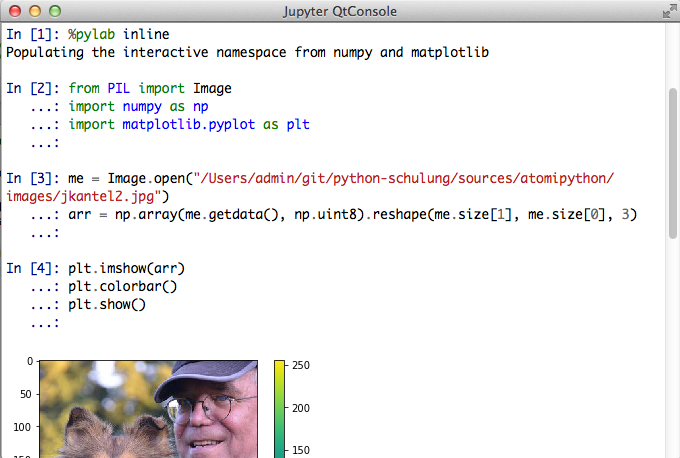

---

# Skizzen mit TextMate

- **TextMate 2** (Open Source, Mac only) ist zur Zeit mein bevorzugter Editor für Python (und fast alles andere auch)
- Seit kurzem ist allerdings **Visual Studio Code** (ebenfalls Open Source, aber plattformübergreifend) in der Andaconda-Distribution enthalten
- Editoren sind Geschmacksfrage (die plattfromübergreifenden Editoren **Atom** (Open Source) und **Sublime Text** (kommerziell) sind ebenfalls beliebt)

---

# Skizzieren mit TextMate (2)

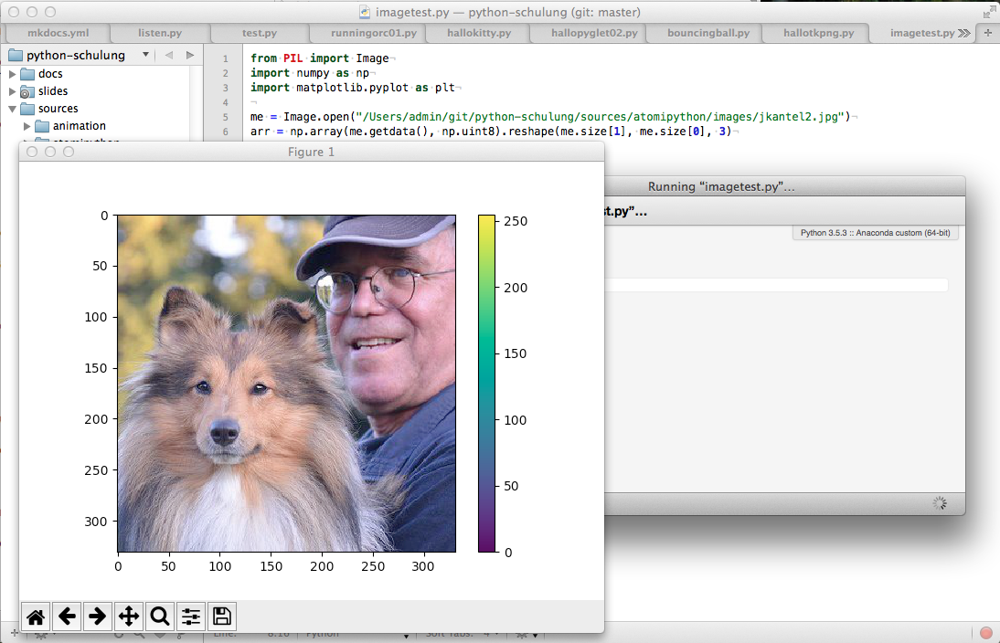

---

# IDEs

- **PyCharm** (Community oder Enterprise) Edition
    - Speziell die *Enterprise Edition* ist wegen der Unterstützung von Web-Frameworks (Django) interessant
- **Spyder** wird bei Anaconda mitgeliefert
- <del>**Rodeo**</del> wird momentan leider nicht mehr weiterentwickelt

Mir persönlich sind IDEs zu schwerfällig, aber auch das ist eine Geschmacksfrage.

---

# Spyder

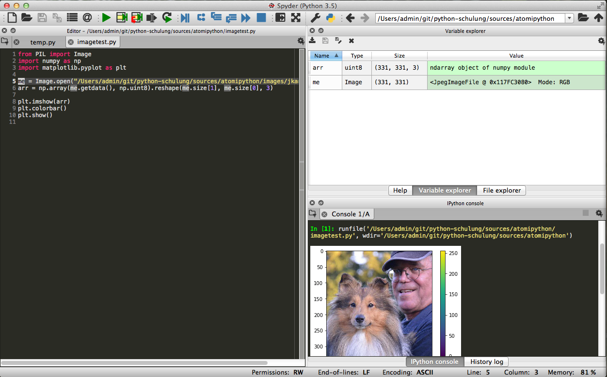


---

# Installationen für diesen Kurs

- Anaconda-Python
- TextMate

## Von mir empfohlen

- PyGlet
- Processing.py
- NodeBox 1

---

# TextMate-Anpassungen

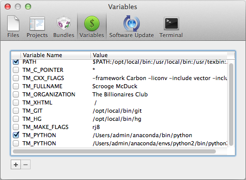

---

## Dann wollen wir mal loslegen

~~~python
import turtle

wn = turtle.Screen()
alex = turtle.Turtle()

alex.forward(50)
alex.left(90)
alex.forward(50)

wn.mainloop()
~~~

---
## Ein komplexeres Beispiel

~~~python
import turtle as t

wn = t.Screen()
wn.colormode(255)
wn.bgcolor(43, 62, 80)
wn.setup(width = 600, height = 600)
wn.title("Ein Hexagon mit der Schildkröte")

hexi = t.Turtle()
hexi.pensize(2)
hexi.pencolor(253, 141, 60)

hexi.penup()
hexi.goto(-62, -87)  # Hexagon im Fenster »einmitten«
hexi.pendown()

~~~~

---

~~~python

hexi.forward(100)
hexi.left(60)
hexi.forward(100)
hexi.left(60)
hexi.forward(100)
hexi.left(60)
hexi.forward(100)
hexi.left(60)
hexi.forward(100)
hexi.left(60)
hexi.fd(100)
hexi.left(60)


wn.mainloop()

~~~

---

## Und jetzt mit `for`-Schleife
~~~python
import turtle as t

wn = t.Screen()
wn.colormode(255)
wn.bgcolor(43, 62, 80)
wn.setup(width = 600, height = 600)
wn.title("Ein Hexagon mit der Schildkröte und for-Schleife")

hexi = t.Turtle()
hexi.pensize(2)
hexi.pencolor(253, 141, 60)

hexi.penup()
hexi.goto(-62, -87)  # Hexagon im Fenster »einmitten«
hexi.pendown()

~~~~

---

~~~python

for i in range(6):
    hexi.forward(100)
    hexi.left(60)

wn.mainloop()

~~~

---

## Und zum Abschluß noch mit zwei Schildkröten

~~~python
import turtle as t

wn = t.Screen()
wn.colormode(255)
wn.bgcolor(43, 62, 80)
wn.setup(width = 600, height = 600)
wn.title("Hexagon-Schleife")

hexi = t.Turtle()
hexi.pensize(2)
hexi.pencolor(253, 141, 60)
hexa = t.Turtle()
hexa.pensize(2)
hexa.pencolor(240, 59, 32)
~~~~

---

~~~python
hexi.penup()
hexi.goto(75, 0)
hexi.pendown()

hexa.penup()
hexa.goto(-25, 0)
hexa.pendown()

for i in range(6):
    hexi.rt(60)
    hexi.fd(100)
    hexa.lt(60)
    hexa.fd(100)

wn.mainloop()
~~~

---

# Fragen?

Alle Folien und Programme gibt es in meinem GitHub-Repositorium zum Kurs: <https://github.com/kantel/pythonschulung2>
## Dann bis nächste Woche …


