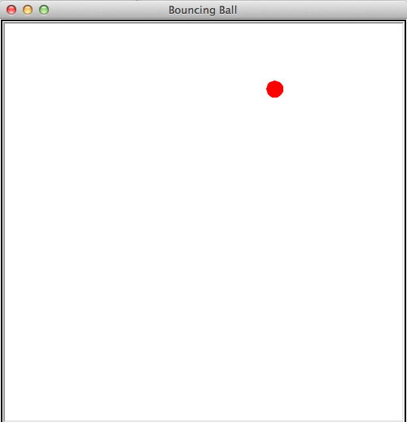
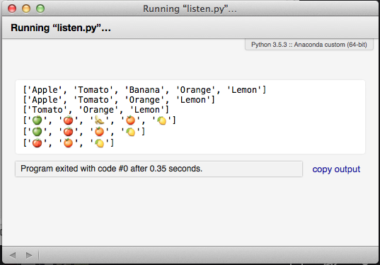

<!-- $theme: gaia -->
<!-- page_number: true -->

# Python Schulung (3)

## Listen, Listen und noch einmal Listen

(cc) 2018: Jörg Kantel

---

# Bouncing Ball: Eine Billardkugel zur Einstimmung

---

## Gegeben sei dieses Template

~~~python
import turtle as t

wn = t.Screen()
wn.colormode(255)
wn.setup(width = 500, height = 500)
wn.title("Bouncing Ball")

ball = t.Turtle()
ball.shape("circle")
ball.color(255, 0, 0)
ball.penup()

wn.mainloop()
~~~~

---

Diese rote Kugel soll dann über den Bildschirm hüpfen:

---

# Listen

- Nach Strings sind **Listen** die wichtigste Datenstruktur in Python (meine ich zumindest)
- Genau wie Strings ist eine Liste eine Folge von Werten. In einem String sind die Werte Zeichen, in einer Liste können die Werte beliebig sein und auch andere Listen enthalten:

~~~python
liste1 = [10, 20, 30, 40]
liste2 = ["apfel", "banane", "zitrone", "orange"]
liste3 = ["SPAM", 2.0, 5, [10, 20]]
leere_liste = []
~~~

---

### Listen sind veränderbar (mutable)

~~~python
kaesesorten = ["Edamer", "Gouda", "Brie", "Cheddar"]
print(kaesesorten)
kaesesorten[1] = "Camenbert"
print(kaesesorten)
~~~
    
Indizes für Listen funktionieren genauso wie für Strings:

- Indizes können berechnet werden, müssen aber immer ganzzahlige Werte (Integer) sein
- Wird versucht, auf ein Element zuzugreifen, das nicht existiert, gibt es einen Index-Error
- Slices sind ebenfalls möglich [n:m], [:m], [n:], [-1]

---

Der `in`-Operator funktioniert auch mit Listen:
~~~python
print("Edamer" in kaesesorten)
True
False
~~~~

---

### Löschen von Elementen aus einer Liste

Es gibt mehrere Methoden, um Elemente aus einer Liste zu löschen:

- Wenn man den Index des Elements kennt, kann man die Methode `pop`  verwenden
- `pop` ändert die Liste und liefert das gelöschte Element zurück

---

~~~python
fruits = ["Apple", "Tomato", "Banana", "Orange", "Lemon"]
for i in range(len(fruits)):
    if fruits[i] == "Banana":
        a = i

fruits.pop(a)
print(fruits)
    
['Apple', 'Tomato', 'Orange', 'Lemon']
~~~

---

Braucht man den gelöschten Wert nicht, kann der `del`-Operator verwendet werden

~~~python
fruits = ["Apple", "Tomato", "Banana", "Orange", "Lemon"]
del(fruits[fruits.index("Apple")])
print(fruits)
["Tomato", "Banana", "Orange", "Lemon"]
~~~

Wenn man das Element kennt, aber nicht den Index, kann auch `remove` verwendet werden

~~~python
fruits = ["Apple", "Tomato", "Banana", "Orange", "Lemon"]
fruits.remove("Apple")
print(fruits)
["Tomato", "Banana", "Orange", "Lemon"]
~~~
 
 ---
 
 ### Ein buntes Beispiel:
 
 ~~~python
fruits = ["Apple", "Tomato", "Banana", "Orange", "Lemon"]
print(fruits)

for i in range(len(fruits)):
    if fruits[i] == "Banana":
        a = i

fruits.pop(a)
print(fruits)

del(fruits[fruits.index("Apple")])
print(fruits)
~~~~

-->

---

~~~python
fruits2 = ["🍏", "🍅", "🍌", "🍊", "🍋"]
print(fruits2)

for i in range(len(fruits2)):
    if fruits2[i] == "🍌":
        a = i

fruits2.pop(a)
print(fruits2)

del(fruits2[fruits2.index("🍏")])
print(fruits2)
~~~
---

---

### Operationen mit Listen

Ähnlich wie bei Strings sind auch bei Listen die Operatoren `+` und `*` defininiert:

~~~python
fruits1 = ["Apple", "Tomato", "Banana"]
fruits2 = ["Orange", "Lemon"]
fruits3 = fruits1 + fruits2
print(fruits3)
['Apple', 'Tomato', 'Banana', 'Orange', 'Lemon'
    
print([0, 1]*4
[0, 1, 0, 1, 0, 1, 0, 1]
~~~

---

### Listen-Slices

Der Slice-Operator funktioniert auch bei Listen analog zu Strings:

~~~python
fruits = ["Apple", "Tomato", "Banana", "Orange", "Lemon"]
print(fruits[1:3])
['Tomato', 'Banana']
print(fruits[:4])
['Apple', 'Tomato', 'Banana', 'Orange']
print(fruits[3:])
['Orange', 'Lemon']
~~~
---

### Methoden für Listen

Python bietet Methoden für Listen. `append` hängt ein neues Element an das Ende einer Liste:

~~~python
fruits.append("Pear")
print(fruits)
['Apple', 'Tomato', 'Banana', 'Orange', 'Lemon', 'Pear']
~~~

---

`extend` erwartet eine Liste als Argument und hängt alle Elemente an eine andere Liste an:

~~~python
commanders1 = ["Christopher Pike", "James T. Kirk"]
commanders2 = ["Jean-Luc Picard", "Jonathan Archer"]
commanders1.extend(commanders2)
print(commanders1)
~~~    
    
In diesem Beispiel bleibt `commanders2` unverändert.

---

`sort` sortiert die Elemente einer Liste von unten nach oben:

~~~python
fruits = ["Apple", "Tomato", "Banana", "Orange", "Lemon"]
fruits.sort()
print(fruits)
['Apple', 'Banana', 'Lemon', 'Orange', 'Tomato']
~~~

Keine der Methoden einer Liste hat einen Rückgabewert. Sie verändern die Liste und liefern `None`. Die Eingabe von

~~~python
t = t.sort()
~~~

ist also sinnlos.

---

### Vorsicht beim Entfernen von Elementen einer Liste in einer Schleife

Schreibt man folgende Schleife:

~~~python
fruits = ["Apple", "Tomato", "Banana", "Orange", "Lemon"]
    
for i in range(len(fruits)):
    if fruits[i] == "Banana":
        fruits.pop(i)
~~~~

Dann erhält man den berüchtigten Fehler: `IndexError: 'list index out of range'`

---

Daher sollte man in diesen (und ähnlichen Fällen) Listen besser rückwärts durchlaufen:

~~~python
fruits = ["Apple", "Tomato", "Banana", "Orange", "Lemon"]
print(fruits)

for i in range(len(fruits) - 1, -1, -1):
    if fruits[i] == "Banana":
        fruits.pop(i)
    
print(fruits)
 ~~~~

 ---
 
 ### Listen und Strings
 
Ein String ist eine Sequenz von Zeichen und eine Liste eine Sequenz von Werten. Aber eine Liste mit Zeichen ist etwas anderes als ein String:

~~~python
s = "SPAM"
l = list(s)
print(l)
['S', 'P', 'A', 'M']
~~~

`list` konvertiert einen String in eine Liste aus einzelnen Zeichen.

---

Soll ein String in eine Liste aus einzelnen Wörtern aufgeteilt werden, ist dafür die Methode `split` zuständig:

~~~python
s = "Veronika der Lenz ist da"
l = s.split()
print(l)
['Veronika', 'der', 'Lenz', 'ist', 'da']
~~~

Wird `split()` ohne Argumente aufgerufen, ist ein Leerzeichen der Trenner. Optional kann aber auch ein Trenner mitgegeben werden, z.B bei CSV-Strings:

~~~python
s = "Alex,Berta,Chris,Doris"
l = s.split(",")
print(l)
['Alex', 'Berta', 'Chris', 'Doris']
~~~~

---

`join` ist das Gegenteil von `split`. `join` ist eine String-Methode, die das gewünschte Trennzeichen als String übernimmt und für diesen String die Methode mit der Liste als Parameter aufruft:

~~~python
l = ['Veronika', 'der', 'Lenz', 'ist', 'da']
t = " "
s = t.join(l)
print(s)
Veronika der Lenz ist da
~~~

Sollen die Elemente ohne Leerzeichen zusammengesetzt werden, kann der Leerstring `""` als Trennzeichen genutzt werden.

---

##### Ein Programm mit Schildkröten und Listen zum Abschluß:

~~~python
import turtle as t
import random as r

WIDTH = 600
HEIGHT = 600

wn = t.Screen()
wn.colormode(255)
wn.bgcolor(43, 62, 80)
wn.setup(width = WIDTH, height = HEIGHT)
wn.title("Creatures 01")

def walk(d):
    x = r.randint(-d, d)
    y = r.randint(-d, d)
    return(x, y)
~~~~

---

~~~python
def exitWorld():
    global keepGoing
    print("I did it, Babe!")
    keepGoing = False

# Auf Tastaturereignisse lauschen
t.listen()
t.onkey(exitWorld, "Escape") # Escape beendet das Spiel

# Bildschirm-Refresh ausschalten
wn.tracer(0)

ants1 = []
ants2 = []
~~~~

----

~~~python
for i in range(25):
    ants1.append(t.Turtle())
    ants1[i].shape("circle")
    ants1[i].color("red")
    ants1[i].penup()
    ants1[i].shapesize(stretch_wid = 0.2, stretch_len = 0.2, outline = None)
    # ants1[i].setpos(r.randint(-WIDTH/2, WIDTH/2), r.randint(-HEIGHT/2, HEIGHT/2))

for i in range(5):
    ants2.append(t.Turtle())
    ants2[i].shape("circle")
    ants2[i].color("green")
    ants2[i].penup()
    ants2[i].shapesize(stretch_wid = 0.5, stretch_len = 0.5, outline = None)
    # ants2[i].setpos(r.randint(-WIDTH/2, WIDTH/2), r.randint(-HEIGHT/2, HEIGHT/2))
~~~

---

~~~python
keepGoing = True
while keepGoing:
    wn.update()
    for i in range(len(ants1)):
        a, b = walk(6)
        ants1[i].setpos(ants1[i].xcor() + a, ants1[i].ycor() + b)
        # Ränder überprüfen
        if ants1[i].xcor() < -WIDTH/2:
            ants1[i].setx(WIDTH/2)
        if ants1[i].xcor() > WIDTH/2:
            ants1[i].setx(-WIDTH/2)
        if ants1[i].ycor() < -WIDTH/2:
            ants1[i].sety(WIDTH/2)
        if ants1[i].ycor() > WIDTH/2:
            ants1[i].sety(-WIDTH/2)
~~~

---

~~~python
    for i in range(len(ants2)):
        a, b = walk(2)
        ants2[i].setpos(ants2[i].xcor() + a, ants2[i].ycor() + b)
        # Ränder überprüfen
        if ants2[i].xcor() < -WIDTH/2:
            ants2[i].setx(WIDTH/2)
        if ants2[i].xcor() > WIDTH/2:
            ants2[i].setx(-WIDTH/2)
        if ants2[i].ycor() < -WIDTH/2:
            ants2[i].sety(WIDTH/2)
        if ants2[i].ycor() > WIDTH/2:
            ants2[i].sety(-WIDTH/2)
~~~~

---

### Das war's für heute …

Nun solltet Ihr in der Lage sein, auch komplexere Programme in Python selber zu schreiben. In der nächsten Woche fahren wir mit Dictionaries und Tupeln fort und wenden uns dann dem Lesen und Schreiben von Dateien zu.
