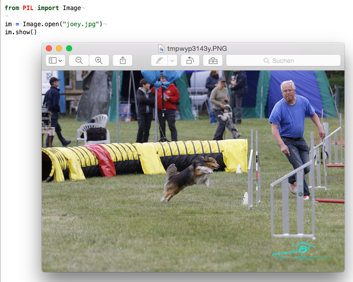

<!-- $theme: gaia -->
<!-- page_number: true -->


# Python Schulung (5)


## Dictionaries, Tuples und Persistenz

(cc) 2018: Jörg Kantel

---

### Dictionaries

- **Dictionaries**, in anderen Sprachen auch *Hashes* genannt, sind wie eine Liste, aber generischer.
- In einer Liste müssen die Indizes Integer-Werte sein.
- In einem Dictionary können hingegen fast alle Datentypen als Indizies Verwendung finden (üblicherweise sind es aber *Strings*.

---

- Ein Dictionary kann man sich als Mapping zwischen einer Reihe von Indizes (**Schlüssel** genannt) und einer Reihe von Werten vorstellen. Die Verknüpfung eines Schlüssels mit einem Wert bezeichnet man als **Schlüssel-/Wert-Paar**.
- Da die Schlüssel **unveränderbar** sein müssen, können als Schlüsel keine Listen oder Dictionaries verwendet werden.
- Daraus folgt: Dictionaries sind veränderbar *(mutable)*.

---

#### Erzeugung und Manipulation von Dictionaries

Ein leeres Dictionary wird mit


    de2nl = dict()
    print(de2nl)
    {}

Huuh, da sind sie, die gefährlichen, geschweiften Klammern. 😱

Sie begrenzen ein Dictionary.

---

Man kann dem bisher leeren Dictionary nun Elemente hinzufügen:

    de2nl["eins"] = "een"
    print(de2nl)
    {'eins': 'een'}

Das weist dem Schlüssel `"eins"` den Wert `"een"` zu. Schlüssel und Wert werden durtch einen Doppelpunkt voneinander getrennt.

    de2nl["zwei"] = "twee"
    print(de2nl)
    {'zwei': 'twee', 'eins': 'een'}

---

Dieses Ausgabeformat `schluessel1 : wert1, schluessel2 : wert2, …` ist gleichzeitig auch ein Eingabeformat. Man kann daher auch Dictionary auch so erzeugen:

    de2nl = {"eins" : "een", "zwei" : "twee", "drei" : "drie", 
    "vier" : "vier", "fünf" : "vijf", "sechs" : "zes"}
    print(de2nl)
    {'drei': 'drie', 'sechs': 'zes', 'fünf': 'vijf',
    'vier': 'vier', 'eins': 'een', 'zwei': 'twee'}

Die **Reihenfolge** der Elemente in einem Dictionary ist **nicht vorhersehbar** (und auch nicht durch den Programmierer zu beeinflussen.

---

#### Die `for`-Schleife für Dictionaries:

    for key in de2nl:
        print(key, de2nl[key])

Auch hier gilt: Die Reihenfolge der Ergebnisse ist nicht vorhersehbar!

#### Der `len`-Operator

    print(len(de2nl))
    6

Der `len`-Operator liefert bei Dictionaries die Anzahl der Schlüssel-/Wert-Paare

---

#### Der `in`-Operator

Der `in`-Operator funktioniert ebenfalls mit Dictionaries:

    "eins" in de2nl
    True

Er teilt mit, ob etwas als *Schlüssel* (nicht als *Wert*) im Dictionary enthalten ist.

---

#### Die Methode `values`

Um festzustellen, ob ein **Wert** in einem Dictionary vorhanden ist, kann man diese Methode nutzen:

    ziffern = de2nl.values()
    print("zes" in ziffern)
    True
    print("negen" in ziffern)
    False

`dict.values()` liefert alle Werte eines Dictionaries als Liste zurück. Danach kann mit allen bekannten Listenmethoden auf diesem Ergebnis operiert werden.

---

#### Weitere Dictionary-Methoden (Auswahl)

- `dict.clear()` entfernt alle Elemente aus einem Dictionary
- `newdict = dict.copy()` erstellt eine Kopie eines Dictionaries
- `t = dict.items()` gibt eine Lieste von Tupel-Paaren der Form `(schluessel, wert)` zurück, die alle Elemente des Dictionaries enthält:


    t = de2nl.items()
    print(t)
    dict_items([('zwei', 'twee'), ('vier', 'vier'), …])


---

- `s = dict.keys()` gibt eine Liste aller Schlüssel des Dictionaries zurück:


    s = de2nl.keys()
    print(s)
    dict_keys(['fünf', 'sechs', 'vier', 'drei', 'zwei', 'eins'])

Die beiden letzten Methoden geben einen *Iterator* zurück, daher klappt folgendes:

    for key in de2nl.keys():
    print(key)

Da auch hier die Reihenfolge nicht vorhersehbar ist, kann man aber nicht via Listen-Index darauf zugreifen.

---

### Warum Dictionaries?

Intern werden Dictionaries als Hash-Tabellen gespeichert, dabei wird jedem Schlüssel ein Integer-Wert zugewiesen und in der Folge wird immer über diesen Integer-Wert auf das einzelne Element eines Dictionaries zugegriffen.

- Das macht den Zugriff auf die einzelnen Elemente sehr schnell,
- hat aber zur Folge, daß die Schlüssel nicht verändert werden dürfen!

---

- Daher können die Werte, nicht jedoch die Schlüssel auch wieder Dictionaries (oder Listen) sein.

- Das macht Dictionaries zu einer geeigneten Datenstruktur, um zum Beispiel `JSON`-Dateien in eine für Python geeignete Form aufzubereiten.

Beispiel [OpenWeatherMap](http://py.kantel-chaos-team.de/weather/) in Processing.py.

---

### Tupel

- Ein **Tupel** ist eine Sequenz von Werten beliebigen Typs.
- Tupel werden mit Integern indiziert.
- Tupel sind daher Listen sehr ähnlich, mit dem Unterschied, daß Tupel *unveränderbar* *(imutable)* sind.
- Tupel können daher **Schlüssel** in Dictionaries sein!

---

Syntaktisch ist ein Tupel ein kommaseparierte Liste von Werten:

    t = "a", "b", "c"
    print(t)
    ('a', 'b', 'c')

Es ist nicht zwingend notwendig, aber üblicherweise werden Tupel in Klammern geschrieben:

    t = ("a", "b", "c")
    print(t)
    ('a', 'b', 'c')

---

Um ein Tupel mit einem einzigen Element zu erstellen, wird ein abscgließendes Komma benötigt:

    t1 = "a",
    print(type(t1))
    <class 'tuple'>

Es reicht nicht, den Wert nur in Klammern zu setzen:

    t2 = ("a")
    print(type(t2))
    <class 'str'>

---

Sondern auch hier ist das abschließende Komma notwendig:

    t3 = ("a", )
    print(type(t3))
    <class 'tuple'>

Weiterhin gibt es natürlich die Möglichkeit, mit der Funktion `tuple()` ein Tupel zu erstellen. Ohne Argumente erstellt sie ein leeres Tupel:

    t4 = tuple()
    print(t4)
    ()

---

Wird dagegen als Argument eine Sequenz übergeben (String, Liste oder Tupel), erstellt `tuple()` ein Tupel mit allen Elementen dieser Sequenz:

    motto = tuple("don't panic")
    print(motto)
    ('d', 'o', 'n', "'", 't', ' ', 'p', 'a', 'n', 'i', 'c')

Die meisten Listen-Operatoren funktionieren auch mit Tupeln:

    print(motto[0])
    print(motto[6:]
---

Wer allerdings versucht, ein Tupel zu verändern, erhält einen Fehler:

    motto[0] = "W"
    TypeError: "'tuple' object does not support item assignment"

Man kann zwar ein Tupel nicht verändern, aber wie bei Strings ein Tupel durch ein anderes ersetzen:

    motto2 = ("W", ) + motto[1:]
    print(motto2)
    ('W', 'o', 'n', "'", 't', ' ', 'p', 'a', 'n', 'i', 'c')

---

#### Tupel-Zuweisung

Wenn man die Werte zweier Variablen vertauschen will, benötigt man normalerweise eine *temporäre* Variable:

    temp = a
    a = b
    b = temp
    
In Python kann das eleganter mit der Tupel-Zuweisung erledigt werden:

    a, b = b, a

---

    a, b = b, a


- Dabei ist die linke Seite ein Tuepl von Variabeln und die rechte Seite ein Tupel von Ausrücken.
- Jeder Wert wird der entsprechenden Variable zugewiesen.
- Vor der Zuweisung werden alle Ausdrücke auf der rechten Seite ausgewertet.
- Die Anzahl der Variablen auf der linken Seite und die Anzahl der Ausdrücke auf der rechten Seite müssen natürlich gleich sein.

---

#### Beispiel

Die rechte Seite der Zuweisung kann eine beliebige Sequenz sein (String, Liste oder Tupel). So kann man zum Beispiel einfach eine Email-Adresse in den Benutzernamen und die Domain aufteilen:

    adr = "joerg@kantel.de"
    uname, domain = adr.split("@")
    print(uname)
    joerg
    print(domain)
    kantel.de

---

#### `zip` – Tupel als Reißverschluß

`zip()` ist eine integrierte Funktion, die zwei oder mehr Sequenzen nach dem Reißverschlußverfahren in eine Liste (Python 2) oder einen Iterator (Python&nbsp;3) zusammenfaßt:

    s = "monty"
    l = [0, 1, 2, 3, 4, 5]
    t = zip(s, l)
    print(list(t))
    [('m', 0), ('o', 1), ('n', 2), ('t', 3), ('y', 4)]

Ich habe lange an die Nützlichkeit von `zip()` gezweifelt, aber glaubt mir, manchmal braucht man es einfach.

---

## Dateien

- Textdateien
- JSON-Dateien
- Daten aus Tabellenkalkulationen

---

#### Textdateien

Um eine Datei zu lesen, benötigt man erst einen *File Descriptor*, den bekommt man mit dem Befehl `open()`

    fd = open("kant.txt")

Man beachte, daß Python die Datei auch finden kann! Das ist nicht immer so einfach, wie es scheint: Python erwartet die Datei im *current working directory*, also im aktuellen Arbeitsverzeichnis. Das ist normalerweise das Verzeichnis, in dem das Programm gestartet wird, IDEs und auch TextMate biegen dieses Verzeichnis oft um (Wurzelverzeichnis des Projekts).

---

Um sicherzugehen gibt man entweder den vollständigen Pfad zum Verzeichnis an, oder man läßt sich das *current working directory* von Python anzeigen:

    import os
    print(os.getcwd())

Dann kann man sich mit `os.join()` den Pfad sicher zusammensstellen:

    path = os.path.join(os.getcwd(), "sources/kant.txt")
---

Und dann die Datei sicher öffnen:

    fd = open(path)

Wenn man die Datei geöffnet hat, kann man ihren Inhalt in eine Variable schreiben und dann den Inhalt dieser Variable manipulieren:

    content = fd.read()
    print(content)

Vieles davon kann man sich aber ersparen, wenn man statt Apfel-R (Run File) Shift-Apfel-R (Run File in Terminal) nutzt.

---

#### Dateien schreiben

Um in eine Text-Datei zu schreiben, gibt es zwei verschiedene Modi:

    fout = open("file1.txt", "w")
    content = fout.write("Alles neu mächt der Mai!")

Wenn man mit dem Schreiben fertig ist, sollte man die Datei schließen:

    fout.close()
    
Hier ist die Datei im `write`-Mode und wird bei jedem Schreibvorgang neu erstellt, das heißt der alte Inhalt wird überschrieben.

---

Daneben gibt es den `append`-Mode, hier wird der neue Inhalt an den alten angehängt:

    fapp = open("file2.txt", "a")
    content = fapp.write("Alles neu mächt der Mai!")
    fapp.close()
    
Natürlich sollte man auch hier nicht vergessen, das Datei-Handle am (Programm-) Ende zu schließen.

----

#### Ausnahmen abfangen

Da beim Lesen und Schreiben von Dateien eine Menge schiefgehen kann, empfiehlt es sich, dieses abzufangen:

```python
try:
    fin = open("boese_datei.txt")
    for zeile in fin:
        print(zeile)
    fin.close()
except:
    print("Es ist etwas faul im Staate Dänemark!")
````

Die Syntax ist ähnlich der einer `if`-Anweisung.

---

## Andere Dateiformate

Für fast alle möglichen Dateiformate gibt es Python-Bibliotheken, die spezielle Methoden dafür bieten, die das Lesen und Schreiben dieser Dateien vereinfachen:

- Für Excel- und/oder CSV-Dateien gibt es das Modul `csv` aus der Standard-Bibliothek
- In der Regel nutze ich diese Bibliothek, wobei ich die Excel-Datei schon aus Excel heraus entweder als Komma-separierte (Text-) Datei (CSV) oder als Tab-separierte (TSV) Datei exportiere.

---

Falls das `csv`-Modul nicht ausreicht, bietet `pandas` nahezu alles, was man braucht, um mit Excel-Files und Dateien aus anderen Tabellenkalkulationen umzugehen:

```python
import pandas as pd

data = pd.read_csv("meine_csv_datei.csv")
```

pandas nimmt per default die erste Spalte als *Label* der Reihe (und nicht als Wert). Dieses Verhalten kann man durch setzen von `index_col = False` abschalten.

---

Um eine CSV-Datei zu schreiben, reicht die `to_csv`-Methode:

```python
data.to_csv("meine_csv_datei.csv")
````
Man kann mit pandas aber auch direkt Excel-Files lesen und parsen:

```python
data = pd.read_excel("datei.xls", sheetname = "Sheet 1")
````

Und wenn man alle Sheets auf einmal lesen will, liest man eben alle auf einem Rutsch ein:

```python
data = pd.ExcelFile("file.xls")
```

---

Und natürlich kann man mit pandas auch Excel-Dateien schreiben:

```python
data.to_excel("file.xls", sheet = "Sheet1")
```

Pandas ist eine umfangreiche Bibliothek zur Datenmanipulation und -visualisierung. Sie operiert nicht auf Texten, sondern auf `Data Frames`, einer Datenstruktur, die sehr viel Ähnlichkeit mit Tabellen aus einer Tabellenkalkulation aufweist.

Dabei gibt es auch Merkwürdigkeiten und Fallstricke. Daher solltet Ihr vor der Nutzung einen Blick ins Handbuch nicht scheuen.


---

Für *JSON*-Dateien gibt es das Modul `json`, ebenfalls aus der Standard-Bibliothek. JSON-Dateien werden meist via einer API direkt aus dem Netz geladen, z.B so:

```python
import json
import urllib2

weatherUrl = "http://api.openweathermap.org/data/…"
weatherData = json.load(urllib2.urlopen(weatherUrl))
````

JSON-Daten werden beim Laden in Dicitionaries umformatiert. Daher gibt es keine Garantie auf die Reihenfolge der Daten, die Ihr gegebebenfalls in der Dokumenation zur API findet!

---

### HTML- und XML-Dateien parsen

- Um (X)HTML-Dateien zu parsen, reicht oft das Modul `html.parser` aus der Standard-Bibliothek aus
- Ein weiteres, viel verwendetes Moduls für HTML und XML ist die Bibliothek `Beautiful Soup`
- Da es aber noch viele andere, teils hochspezialisierte Parser gibt, lohnt sich – bevor man sich in das Abenteuer stürzt – eine Recherche

---

### Bild-Dateien lesen und schreiben



---

- Für das Lesen, Schreiben und Bearbeiten von Bildern ist in Python die Python Image Library (**PIL**) zuständig. Diese funktioniert aber leider nur bis Python 2.7, aber nicht mehr mit Python 3.

- Es gibt aber eine aufrufkompatible Fork namens **Pillow**, die bei Anaconda-Python schon mitgeliefert wird.
- PIL/Pillow besitzt eine Menge von Funktionen und Filtern zur Bildmanipulation und -bearbeitung.

---

Der Aufruf von PIL/Pillow ist einfach:

```python
from PIL import Image

im = Image.open("joey.jpg")
im.show()
```

Das Laden von Bildern geht manchmal schief, daher ist auch hier eine `try/except`-Behandlung sinnvoll:

```python
from PIL import Image

try:
    im = Image.open("joey.jpg")
except:
    print("Konnte das verdammt Bild nicht laden!")

im.show()
```

