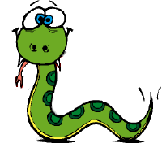

<!-- $theme: gaia -->
<!-- page_number: true -->

# Python-Schulung (6)



# Objektorientierte Programmierung (OOP)

(cc) 2018: Jörg Kantel


---

## Python ist eine **objektorientierte** Programmiersprache.

- Das heißt, Python kennt **Klassen**, **Objekte** und **Methoden**
- Objekte können Eigenschaften an Unterobjekte **vererben**
- Und leider kennt Python auch die **Mehrfach-Vererbung**

---

## Benutzerdefinierte Typen

- Eine **Klasse** ist ein **benutzerdefinierter** Datentyp. Sie definiert die Datenstrukturen und Methoden eines Objektes
- Eine Klasse kann **Attribute** und **Methoden** besitzen
- Eine Klasse ist eine Fabrik zur Herstellung von Objekten, sie »lebt« erst, wenn sie einem Objekt zugewiesen wurde
- Eine Klasse benötigt einen **Konstruktur**

---

### Beispiel: Klasse »Punkt«

```python
class Punkt():

    # Konstruktor
    def __init__(self):
        self.x = 0
        self.y = 0

p = Punkt()
print(p.x)
print(p.y)
```
`p` ist ein Objekt, eine **Instanz** der Klasse `Punkt()`.

---

- Mit `class Klassenname()` wird eine Klassendefinition eingeleitet
- Wann `class Klassenname(object)` in Python 2.7 wirklich nötig ist, hat sich mir bisher nicht erschlossen. Es scheint so, daß es notwendig ist, wenn die Klasse einer *Oberklasse* sein soll
- Klassennamen werden per Konvention mit (mindestens) einem Großbuchstaben am Anfang geschrieben (hier ist auch der *CamelCase* üblich
- Die Methode `__init__(parameter)`  ist der *Konstruktor* einer Klasse (zwei Unterstriche rechts und links)

---

### Objekte sind veränderbar!

Der Zustand eines Objektes kann verändert werden, in dem zum Beispiel seinen Elmenten Werte zuweist:

```python
p.x = 4.0
p.y = 7.0

print(p.x)
print(p.y)
```
Diese Punktschreibweise ist der Auswahl einer Variablen aus einem Modul ähnlich, allerdings wird hier einem Element eines Objektes ein Wert zugewiesen. Diese Elemente bezeichnet man als **Attribute**.

---

## Objekte als Rückgabewerte

Objekte können als Rückgabewerte einer Funktion genutzt werden:

```python
def bewege_punkt(x, y):
    p = Punkt()
    p.x = x
    p.y = y
    return(p)

np = bewege_punkt(7.5, 3.0)
print(np.x)
print(np.y)
```
---

## Methoden

- Eine **Methode** ist einer Funktion   ähnlich, jedoch
    - werden Methoden *innerhalb* einer Klasse definiert und
    - die Syntax für den Aufruf einer Methode unterscheidet sich ebenfalls durch die Punktschreibweise von der Syntax für den Aufruf einer Funktion
- Auch der Konstruktur ist eine Methode

---

## Der Parameter `self`

Standardmäßig heitß der erste Parameter einer Methode `self`. Damit wird der Instanz der Klasse der Name des Objektes zugewiesen:

```python

erster_punkt = Punkt()   # self ist jetzt "erster_punkt"
print(erster_punkt.x)    # self.x

zweiter_punkt = Punkt()  # self ist jetzt "zweiter_punkt"
print(zweiter_punkt.x)   # self.x

```
---

## Methoden und `self`

- Der Parameter `self` macht aus einer Funktion eine Methode. Er muß immer als *erster* Parameter übergeben werden.

- Im Gegenssatz zu einer Funktion werden Methoden durch die Punktschreibweise aufgerufen.

---

```python

class Vector():

    def __init__(self, x, y):
        self.x = x
        self.y = y
        
    def add(self, v):
        self.x += v.x
        self.y += v.y
    
    def print_vector(self):
        print("(" + str(self.x) + ", " + str(self.y) + ")")

p1 = Vector(3, 4)
p2 = Vector(5.0, 7.3)
p1.add(p2)
p1.print_vector()

```

---

- Das gilt auch für alle anderen Eigenschaften eines Objektes, sofern sie mit `self`  zur Objekteigenschaft erklärt wurden:

* Der erste Parameter `self` wird also beim Aufruf mithilfe der Punktnotation vor dem Aufruf geschoben, aus *self* wird daher der Objektname:
   - `self.x`  -> `p1.x`
   - `add(self, v)`  -> `p1.add(p2)`

---

## Die Methode `__str__()`

`__str__()` ist wie `__init__()` eine besondere Methode und soll die String-Repräsentation eines Objektes zurückgeben.

Damit können wir das obige Beispiel vereinfachen:

---

```python

class Vector():

    def __init__(self, x, y):
        self.x = x
        self.y = y
        
    def add(self, v):
        self.x += v.x
        self.y += v.y
    
    def __str__(self):
        return("(" + str(self.x) + ", " + str(self.y) + ")")

p1 = Vector(3, 4)
p2 = Vector(5.0, 7.3)
p1.add(p2)
print(p1)

```
---

## Operator-Überladung

Nun stört an dem Beispiel nur noch die Methode `add()`. Es wäre doch viel einleuchtender, hier `p1 + p2` schreiben zu können. Durch die Definition zusätzlicher, spezieller Methoden, kann das Verhalten von Operatoren mit benutzerdefinierten Typen (Klassen) bestimmt werden.

Wenn also für die Klasse Vektor die spezielle Methode `__add__()` definiert wird:

---

```python

class Vector():

    def __init__(self, x, y):
        self.x = x
        self.y = y
        
    def __add__(self, other):
        self.x += other.x
        self.y += other.y
        return(self)
    
    def __str__(self):
        return("(" + str(self.x) + ", " + str(self.y) + ")")
```
---

Kann man schreiben:
```python
p1 = Vector(3, 4)
p2 = Vector(5.0, 7.3)
p3 = p1 + p2
print(p3)
print(type(p3))

```

Wenn das Verhalten eines Operators so verändert wird, daß es mit benutzerdefinierten Objekten funktioniert, spricht man von **Operator-Überladung**.

---

Für jeden Operator gibt es in Python eine entsprechende spezielle Funktion. Sie sind in der Dokumentation unter <https://docs.python.org/3/reference/datamodel.html#emulating-numeric-types> zu finden. Die wichtigsten (mathematischen) sind:

```python
object.__add__(self, other)
object.__sub__(self, other)
object.__mul__(self, other)
object.__truediv__(self, other)
object.__floordiv__(self, other)
```
---

## Vererbung

- Unter **Vererbung** versteht man die Möglichkeit, eine Klasse als modifizierte Version einer vorhandenen Klasse zu definieren.

- Die neue Klasse (Unterklasse oder Kindklasse) erbt alle Methoden und Attribute der vorhandenen Klasse (Oberklasse oder Elternklasse).

---

## Beispiel mit der Turtle

In der Spieleprogrammierung benötigt man häufig mindestens zwei Klassen, eine Klasse für die Spielewelt (das Fenster) und eine Klasse für die Spielobjekte, die aus alter Tradition meistens *Sprites* genannt werden. Beide Klassen kann man von der Klasse `Turtle` ableiten:

```python
import turtle as t

# Weltgröße
WW = 600
WH = 600
```

-->

---

```python
class GameWorld(t.Turtle):
    
    def __init__(self):
        t.Turtle.__init__(self)
        self.penup()
        self.hideturtle()
        self.speed(0)
        self.color("white")
        self.pensize(3)
        self.keepGoing = True
    
    def draw_border(self):
        self.penup()
        self.goto(-WW/2, -WH/2)
        self.pendown()
        for i in range(4):
            self.forward(WW)
            self.left(90)

    def exit_game(self):
        self.keepGoing = False
```

---

```python
class Sprite(t.Turtle):
    
    def __init__(self, tshape, tcolor):
        t.Turtle.__init__(self)
        self.penup()
        self.speed(0)
        self.shape(tshape)
        self.color(tcolor)
        self.speed = 1
```

Die Klasse `Sprite` wiederum kann als Elternklasse für weitere Spielobjekte, wie zum Beispiel den Spieler (den `Actor`) oder den Gegner (`Invader`) funktionieren:

---

```python
class Actor(Sprite):
    
    def __init__(self, tshape, tcolor):
        Sprite.__init__(self, tshape, tcolor)
        self.speed = 10
        self.x = 0
        self.y = -280
        self.setheading(90)
        self.goto(self.x, self.y)
        
    def go_left(self):
        self.x -= self.speed
        if self.x <= -WW/2 + 20:
            self.x = -WW/2 + 20
        self.setx(self.x)

    def go_right(self):
        self.x += self.speed
        if self.x >= WW/2 - 20:
            self.x = WW/2 - 20
        self.setx(self.x)

```
---

## Aufruf der Elternklasse

Jede Kindklasse muß natürlich den Konstruktor der Elternklasse aufrufen, damit sie weiß, welche Methoden und Attribute sie erbt. Dafür sind in Python (entgegen dem *Zen of Python* zwei konkurrierende Methoden üblich.

Einmal der direkte Aufruf mit dem Namen der Superklasse (wie in den Beispielen), zum Beispiel:

```python
        Sprite.__init__(self, tshape, tcolor)
```

---

Oder der anonyme Aufruf mit `super()`:

```python
        super().__init__(self, tshape, tcolor)
```

In Python 2.7 muß man dem `super()`-Aufruf auch noch den Namen der eigenen Klasse mitgeben:

```python
        super(Actor, self).__init__(tshape, tcolor)
```

Und das `self` hat sich auch verschoben.

---

Ich habe in all den Jahren nicht herausgefunden, welche dieser beiden `super()`-Aufrufe nun die kanonische ist, bevorzuge daher – weil ich sie für klarer und aussagekräftiger halte – den direkten Aufruf:

```python
        Sprite.__init__(self, tshape, tcolor)
```

---

- Außerdem muß die oberste Klasse in der Hierarchie bei Python&nbsp;2.7 von `object` erben.
- Bei den Standardklassen wie `Turtle` ist das gegeben.
- Erben die Kindklassen aber von Eltern ganz oben in der Hierarchie, die der Programmierer selber geschrieben hat, muß er auch darauf achten.

---

Jetzt noch schnell eine Klasse für den **Gegner**:

```python
class Invader(Sprite):
    
    def __init__(self, tshape, tcolor):
        Sprite.__init__(self, tshape, tcolor)
        self.speed = 2
        self.x = -200
        self.y = 250
        self.goto(self.x, self.y)
    
    def move(self):
        self.x += self.speed
        if self.x >= WW/2 - 20 or self.x <= -WW/2 + 20:
            self.y -= 40
            self.sety(self.y)
            self.speed *= -1
        self.setx(self.x)

``` 


